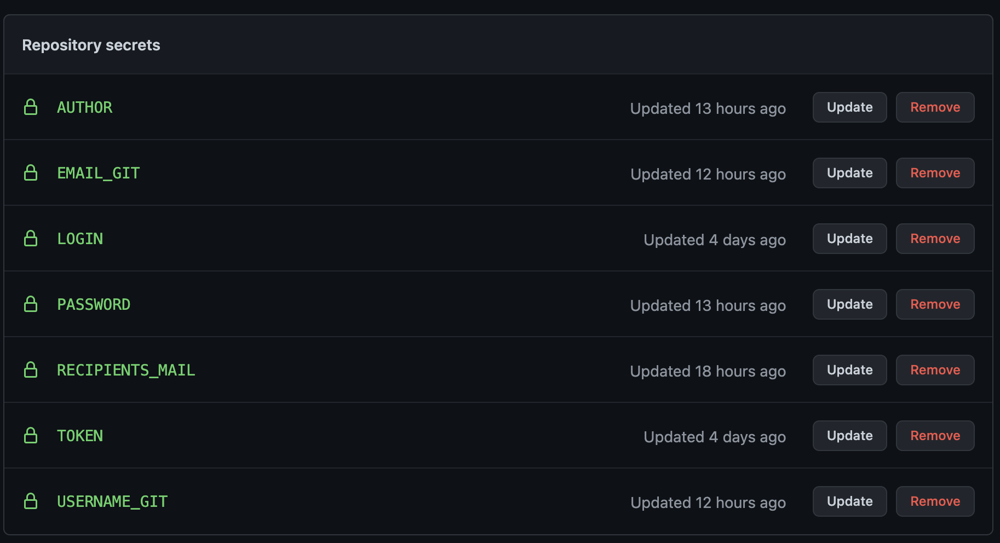
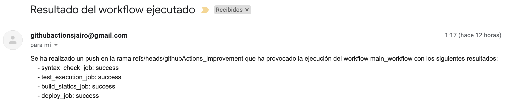

# Práctica Mejora Proyecto Cliente con Github Actions

En esta práctica vamos ha realizar un deploy automatizado sobre el proyecto **Bingo Twingo** y lo haremos en una rama aparte llamada githubActions_improvements. Para ello deberemos utilizar/crear github Actions.

## Bingo Workflow 
En esta parte de código del Workflow  definiremos el nombre y sobre que rama/ramas se ejecuta las acciones y por útlimo describiremos los Jobs.
```
name: main_workflow
on: 
 push: 
  branches:
   - githubActions_improvement
jobs:
```
Posteriormente definiremos los jobs que tendra nuestra Github Actions

### **syntax_check_job:**
El primer job verificará la sintaxis de nuestros ficheros utilizando un linter.

Este job esta compuesto por dos steps, el primero obtendrá el código y el segundo verificará la sintaxis, por otro lado tenemos variables de entorno que utilizaremos para saber sobre que rama se ejecutará, el token proporcionado de github, y sobre que fichero se realizará la verificación que en nuestro caso es el **.eslintrc.js**. Este job nos devolverá un output para poder saber su resultado y utilizarlo más adelante.

```
 syntax_check_job:
    name: syntax_check_job
    runs-on: ubuntu-latest
    steps:
     - name: Checkout code
       uses: actions/checkout@v2
     - name: LinterExecution
       uses: github/super-linter@v3
       env:
          DEFAULT_BRANCH: githubActions_improvement
          GITHUB_TOKEN: ${{ secrets.GITHUB_TOKEN }}
          LINTER_RULES_PATH: /
          JAVASCRIPT_ES_CONFIG_FILE: .eslintrc.js
          VALIDATE_JAVASCRIPT_ES: true
    outputs:  
        output: ${{ job.status }}
```
En este Job debemos crear un `.eslintignore` para evitar que nos haga la comporobación sobre los tests y la documentación del pryecto quedando de la suiguente forma:
```
doc
*.test.js
```
### **stest_execution_job:**
En segundo lugar este job se encargará de ejecutar los test de nuestro porjecto y para ello utilizaremos dos steps.

 El primero (Checkout Code) obtenrá el código de la action y el segundo ejecutara los tests, para ello realizamos dos comandos, `npm i` que instalará las dependencias necesarias y `npm run test` que ejecutara los tests de nuestro proyecto.

 Al igual que en el job de validación sintáctica, devolveremos como output el resultado de este job.
```
test_execution_job:
    name: test_execution_job
    runs-on: ubuntu-latest
    steps:
      - name: Checkout Code
        uses: actions/checkout@v2
      - name: Ejecutar tests
        run: |
          npm i
          npm run test
    outputs:  
        output: ${{ job.status }}    
```
### **build_statics_job:**
Este job nos permitirá hacer el build de nuestro proyecto, por lo tanto solo debrá ejecutarse y la validación de sintaxis y los test se han ejecutado correctamente para ello, obtendremos el código de la action con el job `Checkout code`, a continuación ejecutaremos dos comandos `npm i` (Para instalar las dependencias) y `run buildDev` que es un comando definido en **package.json**, por último deberemos subir los artifacts para poder hacer el deploy en el siguiente job.
```
build_statics_job:
    name: build_statics_job
    runs-on: ubuntu-latest
    needs: [syntax_check_job, test_execution_job]
    steps:
      - name: Checkout code
        uses: actions/checkout@v2
      - name: Build
        run: |
          npm i
          npm run buildDev
      - name: artifact upload
        uses: actions/upload-artifact@v2
        with: 
          name: build
          path: ./dist
    outputs:  
        output: ${{ job.status }}  
```
Al igual que en los jobs anteriores devolvemos el resultado mediante un output.

### **deploy_job:**
Mediante este job realizaremos el deploy de nuestro proyecto utilizando **surge**, pero para ello el job del build debe haber podido realizarse, si no, este job no se ejecutará.

Para ello descargaremos los artifacts subidos en el job anterior y harmos el deploy de estos con el step `Deploy Artifacts`. Finalmente debemos introducir los datos proporiconados por surge, que són el **Token**, **Email**, **Proyecto** y el **Dominio** creado. Estos pasos los hemos visto en las actividades realizadas en clase.

```
deploy_job:
    name: deploy_job
    runs-on: ubuntu-latest
    needs: build_statics_job
    steps:
    - name: Download Artifacts
      uses: actions/download-artifact@v2
      with: 
        name: build
    - name: Deploy Artifact
      uses: dswistowski/surge-sh-action@v1
      with:
        domain: deployBingoGHActions.surge.sh
        project: .
        login: ${{secrets.LOGIN }}
        token: ${{secrets.TOKEN }}
    outputs:  
        output: ${{ job.status }}
```

Al igual que en los jobs anteriores devolvemos el resultado mediante un output.

### **notification_job:**

Este job se ejecutara siempre utilizando un condicional, pero deberá enviarnos un correo electronico con información sobre que rama se ha ejecutado y con el resultado de los jobs anteriores, por ello debemos anyadirlos en el atributo **needs** y poder acceder a sus outputs y obtener el resultado.

```
notification_job:
    name: notification_job
    needs: [syntax_check_job, test_execution_job, build_statics_job, deploy_job]
    runs-on: ubuntu-latest
    if: ${{ always() }}
    steps:
      - name: Checkout code
        uses: actions/checkout@v2

      - name: Send email
        uses: ./.github/actions/send_message
        with:
          author: ${{ secrets.AUTHOR }}
          password: ${{ secrets.PASSWORD }}
          recipients_mail: ${{ secrets.RECIPIENTS_MAIL }}
          branch: ${{ github.ref }}
          workflow: ${{ github.workflow }}
          SYNTAX_STATUS: ${{needs.syntax_check_job.outputs.output}}
          EXECUTION_STATUS: ${{needs.test_execution_job.outputs.output}}
          BUILD_STATUS: ${{needs.build_statics_job.outputs.output}}
          DEPLOY_STATUS: ${{needs.deploy_job.outputs.output}}
```
Este job trabajará sobre una action propia que recibirá los datos de los otros jobs y de Github Secrets.

### Action.yml

En esta acción definimos cuales serán los valores de entrada que espera nuestra action, en mi caso los he puesto todos obligatorios y también debemos definir el valor de salida, además de sobre que fichero se ejecutara, que en nuestro caso es un **index.js**.

```
name: "PRINT values"
description: "print values"
inputs:
  author:
    description: "Email author"
    required: true
  password:
    description: "Email password"
    required: true
  recipients_mail:
    description: "Email receiver"
    required: true
  branch:
    description: "Branch name"
    required: true
  workflow:
    description: "Workflow name"
    required: true
  SYNTAX_STATUS:
    description: "Syntax status"
    required: true
  EXECUTION_STATUS:
    description: "Execution status"
    required: true
  BUILD_STATUS:
    description: "Build status"
    required: true
  DEPLOY_STATUS:
    description: "Deploy status"
    required: true
outputs:
  response:
    description: "Response"
runs:
  using: "node12"
  main: "dist/index.js"

```

### index.js

En este script debemos utilizar todos los valores definidos en la action para poder enviar un correo con los resultados con la libreria `@actions/core`.

Para ello utilizamos la libreria `nodemailer` a la cual deberemos indicarle que servicio vamos a utilizar (en nuestro caso **gmail**) y los datos para poder hacer login, que los hemos puesto como secrets de gitHub para que nadie tenga acceso a ellos.

A continuación deberemos indicar la información que debera tener nuestro mensjae y a quin va dirigido, para ello creamos una constante con todas estas especificaciónes y pasaremos el valor status de todos los jobs.

Finalmente debemos ejecutar el método senMail parametrizando las opciones y en caso de que todo haya ido bien, mostraremos un otuput de respuesta.

**Importante: Antes de hacer un push, deberemos hacer un build del index.js para que así se genere la carpeta dis con el código optimizado, si no, no encontrará la action (Puede realizarse utilizando Vercel con el comando `nnc build index.js`).**

```
const core = require("@actions/core");
const nodemailer = require('nodemailer');

const transporter = nodemailer.createTransport({
  service: 'gmail',
  auth: {
    user: core.getInput('author'),
    pass: core.getInput('password')
  }
});


const options = {
    from: core.getInput('author'),
    to: core.getInput('recipients_mail'),
    subject: 'Resultado del workflow ejecutado',
    text: `Se ha realizado un push en la rama ${core.getInput('branch')} que ha provocado la ejecución del workflow ${core.getInput('workflow')} con los siguientes resultados:
    - syntax_check_job: ${core.getInput('SYNTAX_STATUS')}
    - test_execution_job: ${core.getInput('EXECUTION_STATUS')}
    - build_statics_job: ${core.getInput('BUILD_STATUS')}
    - deploy_job: ${core.getInput('DEPLOY_STATUS')}`
  };

  transporter.sendMail(options, function(error, info){
    if (error) {
      core.setFailed(error);
    } else {
      core.setOutput("Response: ", info.response);
    }
  });
```
NOTA: Es importante descativar la seguridad en nuestro mail para aplicaciones poco seguras. En mi caso, he tenido que crear un mail nuevo sin nunguna persoanlización.

### **update_readme_job:**
Este último job tiene la función de añadir una linea a nuestro `README.md` y parar ello crearemos un step que ejecute un simple **sh** que imprimira la fecha del commit en el fichero `README.md` y posteriormente realizara los comados básicos `git add .`, `git commit -m "commit"` y `git push`, todo ello otorgando las credenciales de nuestro GitHub proporcionadas mediante Secrets.
```
update_readme_job:
    name: Set Date at README
    runs-on: ubuntu-latest
    needs: deploy_job
    steps:
      - name: Checkout Code
        uses: actions/checkout@v2
      - name: Set Date README.md
        run: |
          sed -i '$d' README.md
          echo -e "\n - Última versión desplegada el día: `date`" >> README.md
      - name: Save Date README
        run: |
          git config user.name ${{ secrets.USERNAME_GIT }}
          git config user.email ${{ secrets.EMAIL_GIT }}
          git add . 
          git commit -m "Update README Date"
          git push origin githubActions_improvement
```

### Secrets



### Resultado Mail



### Resultado README


